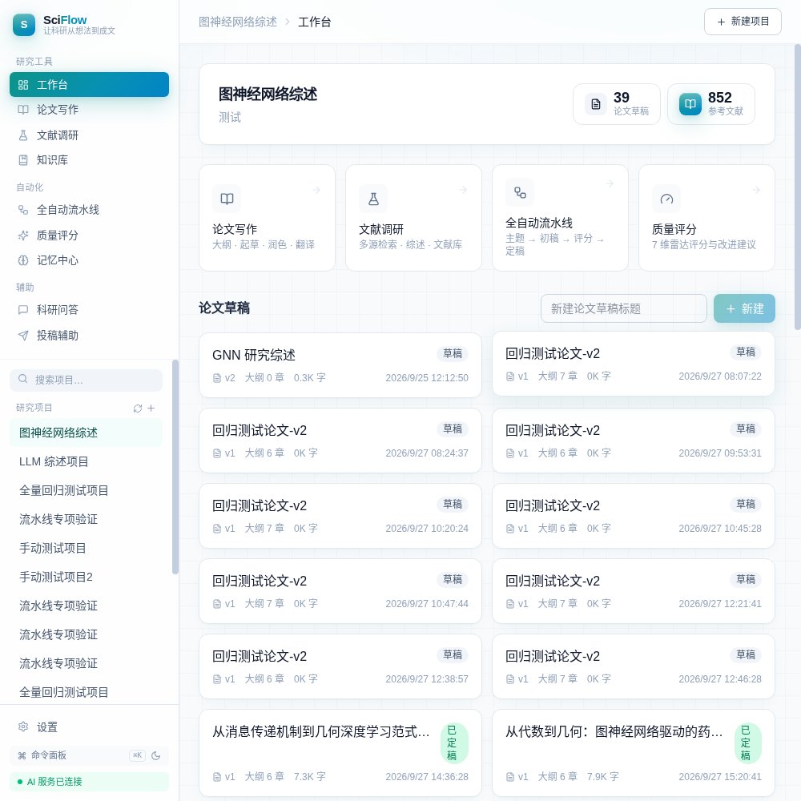
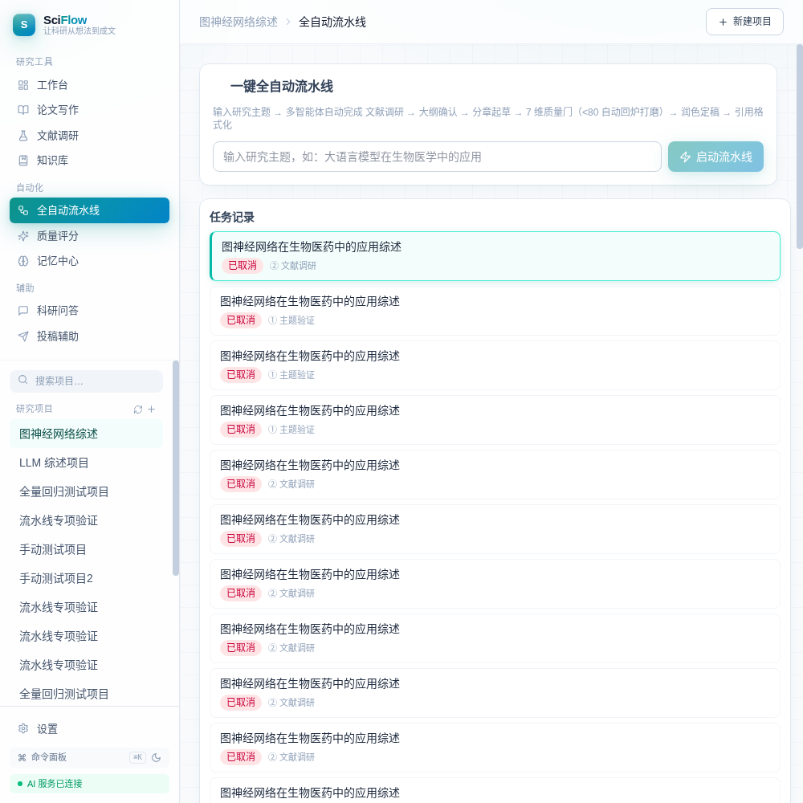
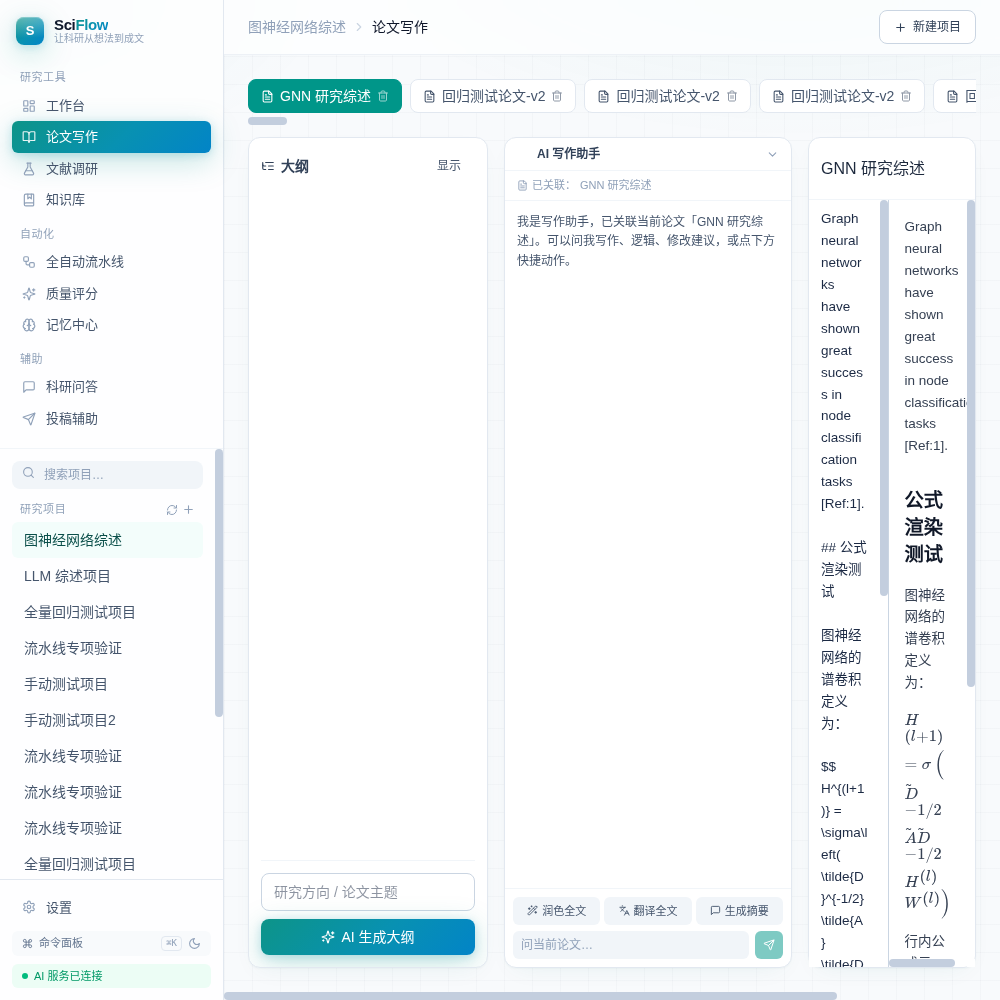
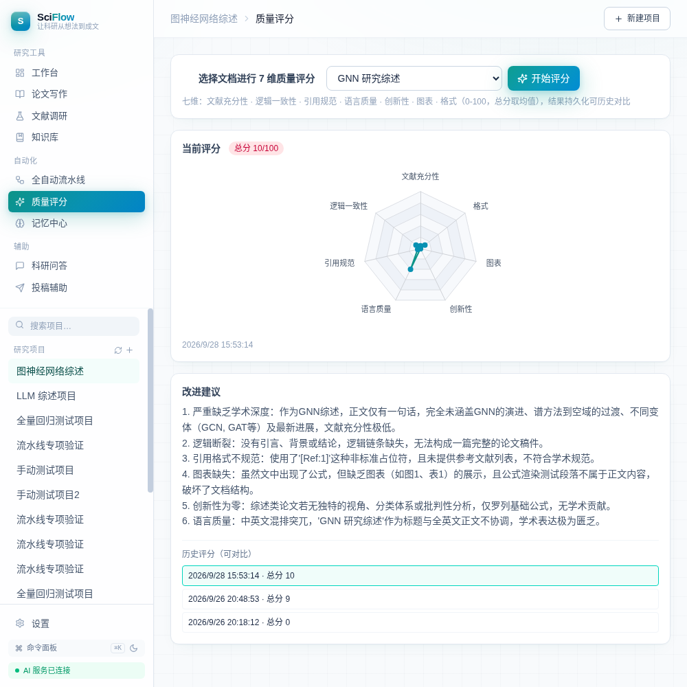

# SciFlow —— 科研全流程 AI 助手

> **Local-First AI Research Workbench · 单用户本地科研智能体工作台**

> **🌐 语言 / Language：[中文](README.md) · [English](README.en.md)**

> **仓库镜像（四平台同步）**
> [GitCode](https://gitcode.com/badhope/sciflow) · [Gitee](https://gitee.com/badhope/sciflow) · [GitHub · X33834](https://github.com/X33834/sciflow) · [GitHub · Morningstar202604](https://github.com/Morningstar202604/sciflow)
> 四仓由 CI 级验证保障：typecheck ×2 · vitest · build ×2 · 密钥校验，全部公开可克隆。

SciFlow 是一个**本地优先、单机部署**的科研 AI 助手：输入一个研究主题，由 Supervisor 编排器调度多类专业子智能体（Planner / 并行 Research / Writer / Reviewer / Polisher），完成 **文献调研 → 研究规划 → 大纲 → 分章起草（边写边查的 Agentic RAG）→ 质量门评分（不达标自动 Reflexion 回炉）→ 润色 → 引用格式化 → 投稿辅助** 的科研全生命周期，并以 NotebookLM 式 RAG 知识库 + 可视化工作台沉淀过程资产。

- **零外部 AI 依赖、零重型图表库**：前端图表全部为手写 SVG（`apps/web/src/components/charts.tsx`）；AI 只通过 **OpenAI 兼容协议**对接你自己的模型 Key。
- **本地优先**：SQLite 单文件开箱即跑，你的文献、笔记、记忆、Key 全部落本地，不建多租户、不上传第三方云。

## 📸 界面预览

| 工作台 · 项目总览 | 全自动流水线 · 多智能体编排 |
| --- | --- |
|  |  |

| 论文写作 · AI 助手 + 公式渲染 | 质量评分 · 7 维雷达 + 改进建议 |
| --- | --- |
|  |  |

> 截图来自真实运行界面（本地部署 · 内置 AI 网关实测）。

## ✨ 特性

### 写作与定稿
- **大纲先行（outline-first）**：AI 生成研究计划与章节大纲，写作页编辑 / 预览 / 分栏三态切换。
- **分章起草 + Agentic RAG**：每章边写边查本地知识库，文内 `[n]` 锚点与文末列表一一对应。
- **学术润色**：三段式润色（原文 + 润色文 + 理由）、中英互译、降重改写；自动保护图表与「参考文献」尾部不被洗掉。
- **多版本历史 + 版本 diff**：每次定稿留存快照，逐版本 LCS 文本比对（`VersionDiffModal`）。
- **一键导出**：Markdown / HTML / LaTeX(.tex) / Word(.docx)，投稿交稿即用。

### 引用与文献
- **8 种引用样式**：APA / IEEE / Vancouver / **GB/T 7714** / Nature / Chicago / Springer / ACS。
- **文内锚点重排**：顺序编码制正文 `[n]` 保持插入序；著者-年制按正文首现自动加 a/b 后缀重排（`CiteReorderButton`）。
- **BibTeX / RIS 导入导出**：文献库元数据去重指纹、`reading_status` 状态机（unread / reading / read / cited）。
- **PRISMA 筛选 + 编码矩阵**：文献调研页按纳入/排除标准筛选、编码归纳。
- **力导向引用网络**：手写 SVG 可交互图谱，直观呈现文献间引用关系。

### 知识库 RAG（NotebookLM 式）
- 本地 **BM25 + TF 向量余弦混合检索**，零依赖中文 Bigram 分词；知识库资料与文献双向绑定，命中块带来源作者/年份卡片。

### 全自动流水线（多智能体）
- Supervisor 编排：**Planner**（目标/子问题/检索策略/风险）→ **Research 并行 ReAct**（think→act→observe 自主补检）→ 大纲人工确认点 → **Writer** 分章起草 → **Reviewer 7 维质量门**（<80 触发 Reflexion 反思并回炉重写，最多 3 轮，自动取最高分轮次定稿）→ **Polisher** 润色 → 引用格式化。
- **执行轨迹可视化**：流水线页展示每个子智能体的状态 / 耗时 / 摘要（`/api/pipeline/:id/agents`）。
- **Checkpoint 断点续跑**：服务重启后自动恢复中断任务，从草稿阶段幂等续跑。
- **模型路由**：fast / strong 双档，问答润色走快模型，规划/长文/评审自动切强模型。

### 质量与评审
- **7 维质量评分**：文献 / 逻辑 / 引用 / 语言 / 创新 / 图表 / 格式（0–100），手写 SVG 雷达图 + 历史评分对比。
- **审稿闭环**：审稿意见结构化解析、逐条回复模板、修回截止日倒计时。

### 投稿辅助
- 选刊匹配（按主题/范围推荐）、Cover Letter 生成、投稿状态跟踪（投稿→under review→修回→录用/拒稿→转投串联）。

### 实验与记忆
- **实验沙箱**：隔离 `spawn` 执行 Python 脚本（`SANDBOX_PYTHON` / `SANDBOX_TIMEOUT_MS` 可配），资源上限防护，降级时给出引导。
- **记忆中心**：情景记忆（项目自动沉淀）+ 程序记忆（写作风格指令，起草自动注入）。
- **学习复盘卡 / 思维导图**：流水线复盘要点结构化沉淀。

### 体验细节
- **⌘K 命令面板**：全局导航 / 新建项目 / 暗色切换；`#/` hash 路由深层链接直达。
- **MCP 工具台**：AI 能力协议化为标准 MCP 工具，设置页逐个可视化调用，参数 JSON Schema 动态校验（Guardrail 拒参即报错）。
- 全站错误文案中文化、移动端窄屏适配、品牌渐变视觉系统。

## 🏗 技术栈

| 端 | 技术 |
| --- | --- |
| 后端 `apps/server` | NestJS 11 · TypeScript（strict）· Drizzle ORM · better-sqlite3（WAL）· zod · 原生 fetch（OpenAI 兼容协议）· 内置零依赖 mock AI 网关（仅 `node:http`） |
| 前端 `apps/web` | React 19 · Vite 6 · TypeScript · Tailwind CSS v4 · react-markdown + KaTeX · lucide-react · **手写 SVG 图表（无 ECharts 等重型图库）** |
| 桌面端 `apps/desktop` | Electron 33 · 内嵌后端（`ELECTRON_RUN_AS_NODE`）· 本地 SQLite（userData 隔离）· electron-builder 三平台打包 · electron-updater 自动更新（opt-in） |
| 工程 | pnpm workspace · vitest 5 · GitHub Actions（Node 22）· Python 3 回归脚本 |

**架构概览**

```
apps/server/src/   后端模块（NestJS）
├── ai/            统一 LLM 服务 + Prompt 模板 + mock 网关 + 全局令牌桶限流
├── projects/      项目管理        ├── documents/   文档/润色/翻译/引用/版本/导出
├── references/    文献库 + 综述     ├── knowledge/   RAG 知识库（BM25+向量）
├── pipeline/      流水线状态机     ├── orchestrator/ Supervisor 多智能体编排
├── research/      文献调研 + 质量评分 + 投稿辅助（controller 集中于此）
├── judgment/      评审闭环         ├── experiments/  实验沙箱
├── chat/          SSE 流式问答     ├── memory/       情景/程序记忆
├── mcp/           MCP 工具协议化    ├── settings/     设置/模型连通自检
├── dashboard/     工作台聚合       ├── db/          Drizzle schema + SQLite
└── common/        输入校验等公共件

apps/web/src/pages/  前端页面
Dashboard(工作台) · Writing(论文写作) · Literature(文献调研) · Knowledge(知识库)
Pipeline(全自动流水线) · Quality(质量评分) · Experiments(实验记录) · Memory(记忆中心)
Chat(科研问答) · Submission(投稿辅助) · Settings(设置)
```

数据链条：`Project → Document（多版本）→ Citation → Reference（真实可追溯）`；`PipelineTask` / `AgentRun` / `ReflexionLog` / `MemoryLog` / `LlmCallLog` 分别记录流水线状态、子智能体执行单元、回炉反思、记忆沉淀与 token 成本。

## 🚀 快速开始

要求：Node ≥ 20（CI 锁定 Node 22）、pnpm ≥ 9（本仓库锁定 `pnpm@11.7.0`）

```bash
# 1. 克隆并安装依赖
git clone <你的仓库镜像地址> sciflow && cd sciflow
pnpm install

# 2. 配置 AI（复制模板并填写你自己的 Key；模板已含全部变量说明）
cp apps/server/.env.example apps/server/.env
#    编辑 apps/server/.env：至少填 AI_BASE_URL / AI_API_KEY / AI_MODEL

# 3. 编译后端
pnpm --filter @sciflow/server build

# 4. 启动（两个终端）
#    后端 :3000
node apps/server/dist/main.js
#    前端 :5173
pnpm --filter @sciflow/web dev

# 5. 浏览器打开
#    http://localhost:5173
```

> SQLite 首次启动自动建表（默认 `apps/server/data/sciflow.db`），零配置开箱即跑。
> 后端默认仅监听 `127.0.0.1`；确需局域网暴露时显式设置 `HOST=0.0.0.0`。

### 🖥 桌面应用端（可选）

```bash
pnpm install && pnpm build          # 先构建后端与前端
pnpm icons                          # 从矢量母版生成应用图标（首次）
pnpm desktop:dev                    # 开发调试（前端 dev server + 桌面壳）
pnpm desktop:dist                   # 打包当前平台安装包 → apps/desktop/release/
```

数据落平台规范目录（Windows `%APPDATA%\SciFlow`），离线可用；详见 [`apps/desktop/README.md`](apps/desktop/README.md) 与 [`docs/BRAND.md`](docs/BRAND.md)。

## 🔑 AI 配置说明

SciFlow 支持**任意 OpenAI 兼容端点**，只需要填 `base_url` + `model` + `key`：

| 变量 | 说明 | 示例值（占位，非真实 Key） |
| --- | --- | --- |
| `AI_BASE_URL` | OpenAI 兼容接口地址 | `https://api.deepseek.com/v1` |
| `AI_API_KEY` | 你的 API 密钥 | `sk-your-api-key-here` |
| `AI_MODEL` | 默认模型 | `deepseek-chat` |
| `AI_MODEL_FAST` | fast 档（问答/润色/翻译/评审 JSON） | 留空则回落 `AI_MODEL` |
| `AI_MODEL_STRONG` | strong 档（规划/长文起草） | 留空则回落 `AI_MODEL` |
| `AI_RPM_CAP` | 每分钟 AI 调用上限（令牌桶防 429） | `8`（长流水线建议 100+） |
| `AI_MOCK` | 设为 `1` 启用本机 mock 网关（无 Key / 无外网跑全链路） | `1` |
| `AI_MOCK_PORT` | mock 网关端口（默认 5099，仅回环） | `5099` |
| `CORS_ORIGIN` | 允许的前端来源（逗号分隔） | `http://localhost:5173` |

兼容端点示例（任选其一，格式均为 `base_url` + 模型名）：火山方舟 `https://ark.cn-beijing.volces.com/api/v3`、DeepSeek `https://api.deepseek.com/v1`、豆包、智谱 `https://open.bigmodel.cn/api/paas/v4`、Kimi `https://api.moonshot.cn/v1`、Ollama 本地 `http://localhost:11434/v1`、云知声 u2-flash 网关等。

> 未配置 Key 时项目管理 / 文献库 / RAG 等本地功能照常可用；AI 功能会给出明确配置提示，**不返回假数据**。

## 🧪 测试与回归

```bash
# 类型检查（双端，CI 强制）
pnpm --filter @sciflow/server typecheck
pnpm --filter @sciflow/web typecheck

# 单元测试（vitest 5，引用格式化等核心纯逻辑）
pnpm --filter @sciflow/server test

# 构建（双端）
pnpm --filter @sciflow/server build && pnpm --filter @sciflow/web build
```

### 内置 mock AI 网关（无 Key / 无外网跑全链路）

`AI_MOCK=1` 时进程内起一个仅监听回环、零依赖（`node:http`）的 mock OpenAI 兼容网关，按 prompt 关键词返回**确定性**响应（研究计划/大纲 JSON、带 `[Ref:N]` 的中文章节、≈87 分 7 维评分不回炉、三段式润色、RAG 答案、期刊匹配等），并支持 SSE 分块。

```bash
# 起后端（mock 模式，放宽限流）
AI_MOCK=1 AI_RPM_CAP=120 DATABASE_PATH=/tmp/sciflow_regression.db PORT=3000 \
  node apps/server/dist/main.js

# 另一终端：全量回归（覆盖全部路由 + 一条流水线端到端产物断言）
SCIFLOW_BASE=http://localhost:3000 AI_MOCK=1 \
  python3 scripts/full_regression.py
```

回归基线（本机实测）：**mock 网关 PASS 162 / FAIL 0**；真实网关路径（未配 Key）PASS 143，其中 2 项为预期的「AI 未配置」语义（`settings/check`→503、创建流水线→400），不代表缺陷。mock 网关仅用于测试/演示，不代表真实模型能力。

## 📚 文档索引

| 文档 | 内容 |
| --- | --- |
| [`docs/product-roadmap.md`](docs/product-roadmap.md) | 产品路线图：现状能力矩阵、设计原则、差距与缺口 |
| [`docs/index.html`](docs/index.html) | 项目官网（静态单页，浏览器直开；GitHub Pages 首页） |
| [`docs/sciflow-code-tree.html`](docs/sciflow-code-tree.html) | 全仓代码树可视化（浏览器打开） |
| [`docs/screenshots/`](docs/screenshots/) | 工作台 / 流水线 / 写作 / 质量评分实机截图 |
| [`CONTRIBUTING.md`](CONTRIBUTING.md) | 开发环境、提交规范、PR 流程 |
| [`SECURITY.md`](SECURITY.md) | 安全设计要点与漏洞披露方式 |
| [`CHANGELOG.md`](CHANGELOG.md) | 版本变更记录 |

## 🌱 演示数据说明

- 首次启动在演示项目中预置 **1 篇示例文献 + 1 份知识库资料**，便于立刻体验文献绑定、RAG 检索与流水线；
- 全流程产物（文档/版本/引用/记忆）均存于本地 SQLite，删除 `DATABASE_PATH` 指向的 db 文件即可回到干净状态。

## 🐳 Docker 部署

```bash
cp apps/server/.env.example .env   # 按注释填写 AI_BASE_URL / AI_API_KEY / AI_MODEL
docker compose up -d --build      # 前端 nginx 静态托管 :8080 → 后端 :3000
# 容器部署需设置 CORS_ORIGIN=http://localhost:8080
```

## 📜 License

[MIT](LICENSE) © 2026 SciFlow Contributors
